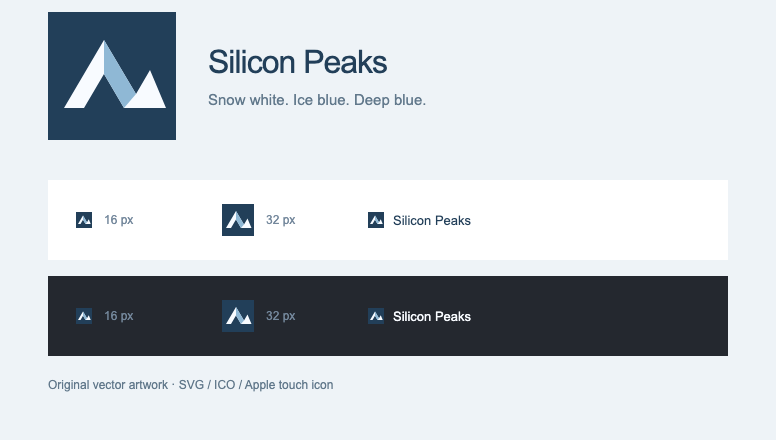

# Asset provenance

For the official company and investor assets added on 29 September 2026, including transformations and remaining unresolved marks, see [directory corrections](DIRECTORY-CORRECTIONS.md). Exact asset URLs are recorded in `data/logo-audit.json`.

## Photography

The redesign uses licensed photographs, independent of the SecurityPal reference site. No SecurityPal mountain or cloud assets are included.

- **Mount Everest from Gokyo Ri, 5 November 2012**, by Rdevany. [Original and license](https://commons.wikimedia.org/wiki/File:Mt._Everest_from_Gokyo_Ri_November_5,_2012.jpg). Used under [CC BY-SA 3.0](https://creativecommons.org/licenses/by-sa/3.0/). Local files: `assets/everest.webp`, `assets/everest-small.webp`. Resized/compressed; cropped and overlaid in the layout. The social preview `assets/images/social.jpg` is a cropped adaptation with typography. These adaptations retain CC BY-SA 3.0.
- **Golden Gate Bridge as seen from Battery East**, © Frank Schulenburg, 24 June 2017. [Original and license](https://commons.wikimedia.org/wiki/File:Golden_Gate_Bridge_as_seen_from_Battery_East.jpg). Used under [CC BY-SA 4.0](https://creativecommons.org/licenses/by-sa/4.0/). Local files: `assets/golden-gate.webp`, `assets/golden-gate-small.webp`. Resized/compressed and cropped for display. These adaptations retain CC BY-SA 4.0.

The photograph captions provide linked attribution and describe the modifications. Photographs and adaptations are separate from the Apache-2.0 code license and the CC0 dedication of the Silicon Peaks name.

## Website logos

Most directory favicons are cached from the domains recorded in `data/directory.json`, using Google or DuckDuckGo favicon endpoints and direct website requests. They identify linked websites; they do not assert sponsorship. Such caches can be outdated. `data/logo-audit.json` records actual local availability; unavailable company marks retain initials or names, and diplomatic listings can retain their national flags. We do not substitute fabricated logos.

Specifically researched replacements:

- Incessant Rain: seahorse emblem cropped from the [official blue logo](https://incessantrain.com/public/front/images/logo-blue.png), resized locally.
- MIT: full red wordmark from [MIT Brand](https://brand.mit.edu/logos-marks/mit-logo), trimmed and resized as `mit-wordmark.png`.
- Alibaba Group: artwork from [Alibaba Group](https://www.alibabagroup.com/en-US/), replacing the unrelated Alibaba.com mark.
- Y Combinator: [official press assets](https://www.ycombinator.com/press).
- Oxford: the university arms from the Wikimedia Commons image linked by the University of Oxford Wikipedia article, replacing a Drupal favicon.
- Omnicom: wordmark from Wikimedia Commons, `File:Omnicom_Group_logo.svg`.
- Tribhuvan University, NAST and KOICA: organization marks from their Wikipedia/Commons entries, resized locally.
- Nepal diplomatic emblem: optimized from the original repository's `nepal-emblem.png`. It is not used for the Canadian consulate.

All trademarks remain the property of their owners. The original repository's SVG marks in `logos/marks/` remain available for the airline strip.

## Fonts and map

Geist Latin variable WOFF2 is self-hosted under the SIL Open Font License in `assets/fonts/Geist-OFL.txt`. Literata Latin italic WOFF2 is also self-hosted; its SIL Open Font License is in `assets/fonts/Literata-OFL.txt`. Georgia is the fallback. No remote font service is called.

TopoJSON Client 3.1.0 and World Atlas countries-110m data are self-hosted. Their Michael Bostock copyright and ISC permission notice are in `assets/map-LICENSE.txt`. Geographic source data is Natural Earth. The map is illustrative, not a current airline route database.

The favicon is original SVG artwork for this project, revised on 29 September 2026: two angular peaks with an ice-blue facet on a deep-blue square. Its palette is `#223f59`, `#f8fbff`, and `#8fb8d5`. The SVG is 255 bytes; the ICO contains 16, 32 and 48 pixel variants, and the Apple touch icon is 180 pixels. A 512 pixel PNG is included for reuse. Raster exports are rendered from the SVG and downsampled with Lanczos filtering. All four public pages reference the same icons, with versioned paths in production. Navigation and footer retain the typographic Silicon Peaks wordmark.

## Owner-supplied film and illustrations — 28 September 2026

The user supplied the following media from Downloads for this design; these are independent of SecurityPal's assets.

- `silicon_peaks_story_preview.mp4`: full 23-second, 1280×720, 24 fps, silent H.264 film. Preserved locally as `assets/media/silicon-peaks-story.mp4` (about 1.1 MB).
- `silicon-peaks-night.mp4`: local color-treated derivative of that film using FFmpeg negate plus reduced saturation, H.264 CRF 26 with faststart (about 572 KB). Its timing matches the Snow film.
- `hero-poster.webp` / `hero-night-poster.webp`: frame-derived posters for immediate rendering, reduced motion, data saving and autoplay fallback.
- `ChatGPT Image Sep 28, 2026, 05_57_13 AM.png`: supplied Snow mountain / Golden Gate artwork, optimized to `snow-art.webp`.
- `ChatGPT Image Sep 28, 2026, 05_57_20 AM.png`: supplied Night artwork, optimized to `night-art.webp`.

The unused paper-colored variant remains in Downloads; it is not a third site theme or public asset. The illustrations are artistic composites, not a geographically precise panorama of the eight named mountains.

A detailed new-art prompt is saved in [prompts/himalayan-footer.md](prompts/himalayan-footer.md). No new image generation occurred: the built-in image generation tool was unavailable in this session. The scenic part of the footer uses the supplied Snow illustration.

Entrepreneurs First's icon is from its official homepage icon link: `https://www.joinef.com/wp-content/uploads/2025/03/web-app-manifest-512x512-1-150x150.png`, saved locally as `assets/logos/entrepreneurs-first.png`.

## Simplified Snow presentation

The site now serves only the Snow film and poster. Former Night assets have moved to `docs/archive/media/`, outside the public build. The supplied Snow bitmap is restored for the scenic footer. The footer uses individual photographs and short profiles; the small SVG mountain drawings have been removed.

Every press entry and every Featured In link now has a locally cached publication icon. The source URLs were recovered from the original repository's press markup and use Google's favicon endpoint for each publication's actual domain. Assets are `assets/logos/press-*.png`, decoded and normalized to PNG locally. TechCrunch retains the original SVG mark; Pathao retains its cached domain mark. These identify publications and retain the owners' trademark rights.

Literata italic is the Latin subset served by Google Fonts at `fonts.gstatic.com/s/literata/v40/`, saved as `assets/fonts/literata-italic.woff2` (about 21 KB). The font is not modified; the corresponding OFL is included.

## Eight-mountain photo gallery

All eight photographs were resolved through Wikipedia and the Wikimedia Commons image metadata API. Full source records, artist names, licenses and local variants are in `data/mountain-photos.json`. Each card carries linked attribution and license information. Images were resized to at most 800 pixels wide and compressed to WebP; the layout crops them for display. Each adaptation retains its source license, independently of the code and name licenses.

- **Everest** — Rdevany, CC BY-SA 3.0. [Source](https://commons.wikimedia.org/wiki/File:Mt._Everest_from_Gokyo_Ri_November_5,_2012.jpg). Local: `assets/mountains/everest.webp`.
- **Kangchenjunga** — Tomabarker, CC BY 3.0. [Source](https://commons.wikimedia.org/wiki/File:Kangchenjunga_PangPema.JPG). Local: `assets/mountains/kangchenjunga.webp`.
- **Lhotse** — Uwe Gille, CC BY-SA 3.0. [Source](https://commons.wikimedia.org/wiki/File:Lhotse-fromChukhungRi.jpg). Local: `assets/mountains/lhotse.webp`.
- **Makalu** — Ben Tubby, CC BY 2.0. [Source](https://commons.wikimedia.org/wiki/File:Makalu.jpg). Local: `assets/mountains/makalu.webp`.
- **Cho Oyu** — Robstar06 at German Wikipedia, Public domain. [Source](https://commons.wikimedia.org/wiki/File:Chooyu.jpg). Local: `assets/mountains/cho-oyu.webp`.
- **Dhaulagiri** — Sergey Ashmarin, CC BY-SA 3.0. [Source](https://commons.wikimedia.org/wiki/File:Dhaulagiri_-_view_from_aircraft.jpg). Local: `assets/mountains/dhaulagiri.webp`.
- **Manaslu** — Ben Tubby, CC BY 2.0. [Source](https://commons.wikimedia.org/wiki/File:Sunrise,_Manaslu.jpg). Local: `assets/mountains/manaslu.webp`.
- **Annapurna** — PrajwalMohan, CC BY-SA 4.0. [Source](https://commons.wikimedia.org/wiki/File:South_Face_of_Annapurna_I_(Main).jpg). Local: `assets/mountains/annapurna.webp`.

## Logo audit follow-up

The 28 September review inspected all 277 company, university, investor and organization logo records and checked every rendered image in the browser. Official website assets replaced the Coca-Cola, Kathmandu University, NAAMII (two placements), FOG Ventures and Echowin marks. Techkraft and Codewing now have verified marks and corrected official links. Source URLs are recorded in `data/logo-review-2026-09-28.json`.

DBA and Tectonic Capital used the same GoDaddy parked-domain icon. Those icons are removed. Seventeen records still have no verified image and retain readable names or initials; the French embassy retains its flag. These are listed in `data/logo-audit.json` with `available: false`. Existing domain favicon caches are not a claim that every brand identity has been independently certified.

## Footer artwork, September 28 update

The owner supplied an AI-generated Himalayan panorama for the footer. Responsive WebP exports at 800px and 1600px replace the earlier bridge composite. The image is identified as generated artwork in its alternative text. The eight mountain profiles continue to use credited, real photographs.
