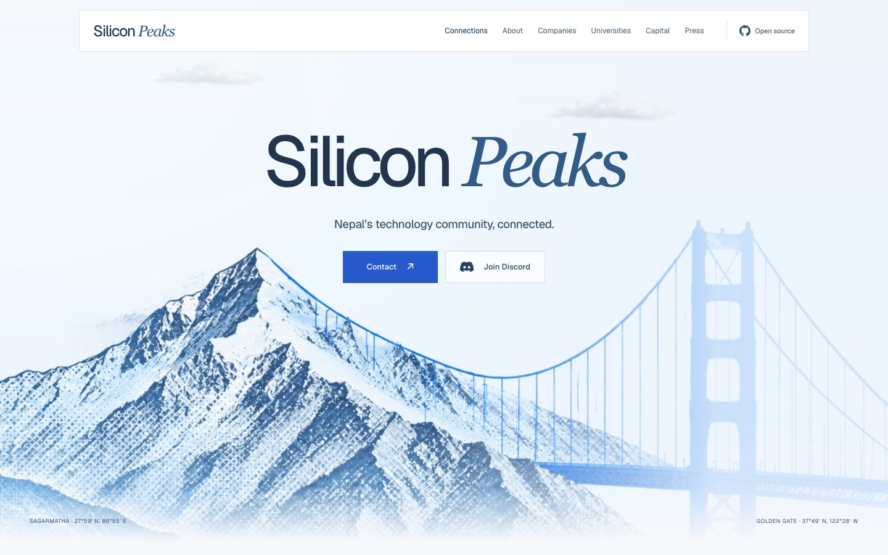
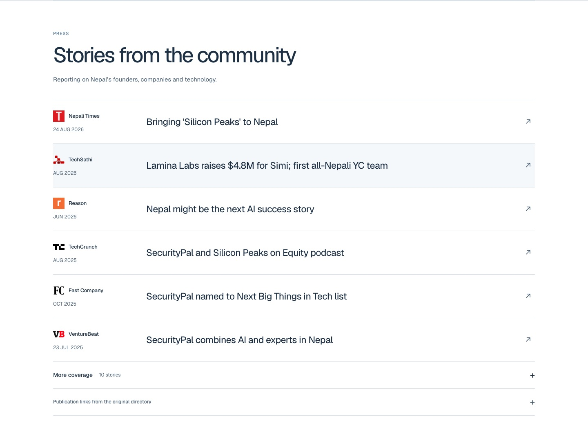

# Design refinement validation

The follow-up [directory corrections and layout notes](DIRECTORY-CORRECTIONS.md) supersede this first-pass report where noted. Publisher-only links were subsequently removed, the Nepali-inspired divider was restored across main sections, and nine directory entries received verified logo and link updates. YC's rendering was corrected. The original directory data is therefore no longer unchanged in the current revision.

Reviewed on 29 September 2026. This pass refines the Snow redesign without changing the directory data, canonical URLs, image credits, footer artwork or contact destinations.

## Changes

| Commit | Result |
| --- | --- |
| `a2966c5` | Reduced the featured press strip from 14 marks to five distinct publications, each linked to coverage. |
| `d6b44a9` | Shortened introductory and story copy, simplified headings, and kept the original section order. The main story now uses 90 words including its headings. |
| `87ac0fe` | Replaced the press card wall with six selected stories, ten additional articles in an expandable archive, and seven unique publisher links. Forbes appears once as a publisher link. |
| `93c97ff` | Unified square surfaces, readable type sizes, spacing and content widths. Company and university headings remain centered. |
| `3dbcd39` | Removed repeated content fades and decorative hover movement. The hero film, map, clocks and mountain sequence remain. |
| `a910a91` | Replaced conflicting double-line ornament rules with one aligned separator. |
| `60d73dd` | Kept press arrows in the layout grid so they no longer overlap dates on mobile. |

The source directory and original preservation data are unchanged. Tests now preserve original press URLs and section structure without requiring superseded marketing paragraphs or a fixed press-card count.

## Validation

- Build and static public export succeed. All 10 automated tests pass.
- No horizontal page overflow at 375, 390, 768 or 1440 pixels wide.
- All company, university, investor and organization surfaces have square corners.
- All five separators are one pixel high, aligned with content and free of decorative pseudo-elements.
- Content is visible without waiting for reveal animations. Hero video plays on the mobile browser check.
- Mobile navigation opens and closes with Escape. The press archive expands to show ten articles and collapses again.
- The timezone calculator finds Tokyo and adds it with arrow keys and Enter. Bangalore and London remain its default comparisons. Escape closes the active suggestions first, then the dialog.
- No new browser console errors after a clean reload.
- At 1440 pixels, the closed press section is 1,091 pixels high, compared with approximately 2,495 pixels before this pass.
- No new dependencies or client JavaScript were added. Existing transfer-budget checks pass.

These are Chromium checks, not a new cross-browser certification. Lighthouse was not rerun for this presentation-only pass. Previous results and their exact revision remain in [PERFORMANCE.md](PERFORMANCE.md).

## Screenshots

 

## Remaining limits

Some legacy directory records still use readable initials or a flag because no verified logo asset is available. Original economic estimates remain qualified community snapshots. Publisher homepage links are separated from article links to avoid presenting unsupported headlines as verified coverage.
